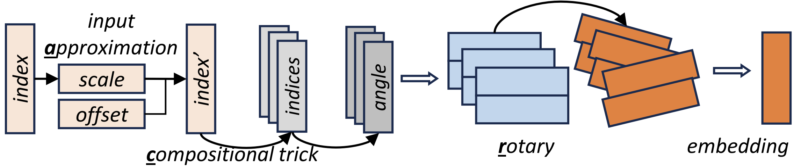

# ARCE: Approximate Rotary Compositional Embedding for Memory Efficient Deep Recommender Systems


## How to
-  ARCE is implemented fully in PyTorch. No other library is required and compilation is ever needed!
- ARCE and can be initialized using similar semantics like the canonical `torch.nn.Embedding` in PyTorch:
```python
from arce import ApproxRotaryCompEmbed

device = torch.device('cuda')
arce_emb = ApproxRotaryCompEmbed(
    max_index,
    embedding_dim,
    factor_mode='coprimes',
    approximation=0.001,
).to(device)
```

## Implementation


 1. **Index approximation:** When an index is input into ARCE, it will fist be approximated, which is an affine transformation based on approximation coefficient. 
 2. **Compositional factorization:** Approximated index will be factorized into a set of indices based on the compositional tricks.
 3. **Rotary embedding:** The factorized indices will be used to calculate the rotation angles for the rotary embedding. 
 4. **Aggregation:** The final embedding of this index will thus be the aggregation of the separate rotary embedding components.

For detailed implementation, check `./arce.py`.

## Contact
If you have any questions, feel free to contact:
```
Anonymous
```

If you find ARCE useful in your research or project, please consider citing out paper:
```
In-submission
```
